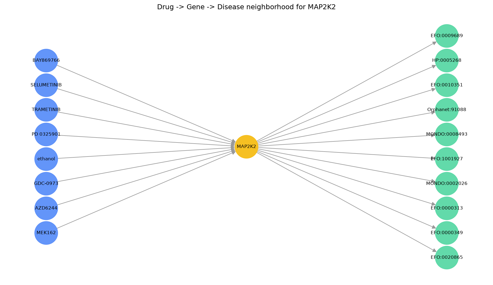

# Biolink Source Ingestion and Mapping

Ingests two public biomedical sources and maps their entities and relationships onto the
[Biolink Model](https://biolink.github.io/biolink-model/), the open schema used to build
interoperable biomedical knowledge graphs. The interesting part here are
the mapping decisions: where a source does not map cleanly onto Biolink, those judgment
calls are documented in [mappings/mapping_decisions.md](mappings/mapping_decisions.md).

   

## Demo

A drug-gene interaction and a gene-disease association, from two independent sources, are
unified onto one gene node so they connect:

```
DRUG_NAME:OLAPARIB --biolink:negatively_regulates--> NCBIGene:672 --biolink:gene_associated_with_condition--> EFO:0000305
        (DGIdb)                                          (shared gene)                                      (Open Targets)
```

The raw rows that produced this, and how each field was mapped, are in
[output/before_after_examples.md](output/before_after_examples.md).


## Why this matters

Biomedical data is spread across many sources that each use their own vocabularies and
identifier schemes. Building a knowledge graph means reconciling those sources onto one
shared model so they can be queried together. Biolink is the community standard for that
model. This project shows the core of that reconciliation on a small scale: take a drug-gene
source and a gene-disease source, normalize their identifiers, map their relationship
vocabularies to Biolink predicates, and produce a connected set of Biolink triples, while
documenting the cases that required a decision.

## What it does

1. Ingests a sample of DGIdb drug-gene interactions and Open Targets gene-disease associations.
2. Unifies genes from both sources to a single NCBIGene identifier using the HGNC map, so the
   same gene is one node and the two sources can connect.
3. Maps DGIdb interaction types (inhibitor, agonist, modulator, and so on) to Biolink predicates,
   using directional predicates where the direction is known and the broad parent in cases it isn't.
4. Normalizes disease identifiers to CURIE form and keeps each in its original ontology.
5. Writes Biolink nodes and edges, and validates that every category and predicate is a real
   Biolink term.

## Repository layout

```
biolink_source_mapping/
├── sample_sources.py            # builds the small samples from the full downloads
├── mappings/
│   ├── category_map.csv         # source entity type -> Biolink category
│   ├── predicate_map.csv        # source relationship -> Biolink predicate
│   └── mapping_decisions.md     # the judgment calls (the core of the project)
├── data/
│   ├── raw/                     # the committed small samples
│   ├── mondo/                   # MONDO release assets for disease label lookup
│   └── README.md                # source provenance and licenses
├── src/
│   ├── ingest.py                # load and clean the samples
│   ├── map_to_biolink.py        # apply the mappings, produce nodes and edges
│   ├── mondo_labels.py          # MONDO id -> disease name from mondo_nodes.tsv
│   ├── fetch_mondo_release.py   # download mondo_nodes.tsv from a MONDO release
│   ├── validate.py              # confirm Biolink terms, print a summary
│   └── requirements.txt
└── output/
    ├── nodes.csv                # Biolink entities
    ├── edges.csv                # Biolink triples
    ├── mondo_name_enrichment.csv # MONDO id -> label lookup report (when --mondo-nodes used)
    └── before_after_examples.md # raw row -> triple, with explanation
```

## Run it

From the project root:

```
pip install -r src/requirements.txt

# 1. build the samples from the full downloads (see data/README.md for where to get them)
python sample_sources.py --dgidb dgidb_interactions.tsv --opentargets opentargets.parquet --genemap hgnc_complete_set.txt --n-genes 150

# 2. produce the Biolink nodes and edges
python src/fetch_mondo_release.py   # once: download MONDO v2026-06-02 labels
python src/map_to_biolink.py --hgnc hgnc_complete_set.txt --mondo-nodes data/mondo/mondo_nodes.tsv

# 3. validate and summarize
python src/validate.py
```

Install `bmt` (the Biolink Model Toolkit, included in requirements) so validation checks
against the authoritative Biolink model rather than the built-in fallback list.

## Mapping decisions

The mapping tables handle the routine cases. The decisions that needed reasoning can be found in [mappings/mapping_decisions.md](mappings/mapping_decisions.md), including reconciling
gene identifiers across two schemes, normalizing mixed disease ontology prefixes, mapping an
inconsistent interaction-type vocab to Biolink predicates, handling unknown relationships
differently by edge type, and a source data-quality issue.

## Data and license

Uses small samples of DGIdb (open) and Open Targets (CC0), plus the HGNC gene map. The full
downloads are not committed. See [data/README.md](data/README.md).

## Planned enhancements

- ~~Normalize disease identifiers to a single ontology (MONDO) using a cross-reference file.~~
  **Partial:** MONDO disease nodes are now enriched with human-readable labels from the
  pinned MONDO release (`v2026-06-02`). Cross-ontology normalization (EFO/DOID → MONDO) is
  still planned.
- An optional LLM-assisted step that proposes Biolink mappings for source terms not yet in the
  mapping tables, with a human accepting or rejecting each suggestion. The current version is
  fully deterministic.
