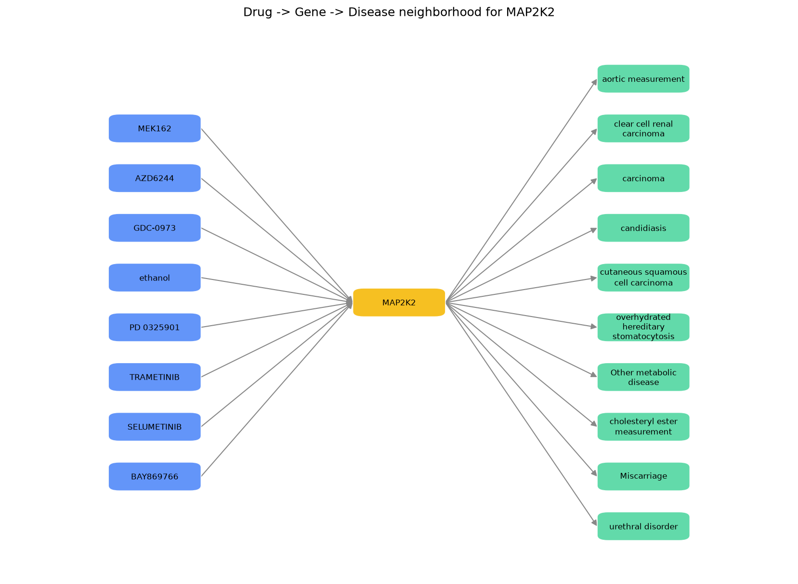

# Biolink Source Ingestion and Mapping

Ingests two public biomedical sources and maps their entities and relationships onto the
[Biolink Model](https://biolink.github.io/biolink-model/), the open schema used to build
interoperable biomedical knowledge graphs. The interesting part here are
the mapping decisions: where a source does not map cleanly onto Biolink, those judgment
calls are documented in [mappings/mapping_decisions.md](mappings/mapping_decisions.md).

   

## Demo

A drug-gene interaction and a gene-disease association, from two independent sources, are
unified onto one gene node so they connect:

```
DRUG_NAME:OLAPARIB --biolink:interacts_with--> NCBIGene:8314 --biolink:gene_associated_with_condition--> MONDO:0008315
        (DGIdb)                                  BAP1                                                   prostate cancer
                                             (shared gene)                                               (Open Targets)
```

The raw rows that produced this, and how each field was mapped, are in
[output/before_after_examples.md](output/before_after_examples.md).


## Why this matters

Biomedical data is spread across many sources that each use their own vocabularies and
identifier schemes. Building a knowledge graph means reconciling those sources onto one
shared model so they can be queried together. Biolink is the community standard for that
model. This project shows the core of that reconciliation on a small scale: take a drug-gene
source and a gene-disease source, normalize their identifiers, map their relationship
vocabularies to Biolink predicates, and produce a connected set of Biolink triples, while
documenting the cases that required a decision.

## The pipeline

`src/pipeline.py` runs five steps in order. Each is a function in that file.

1. **ingest** the two committed samples, drop rows that cannot form a triple.
2. **map** to Biolink. Genes unify to a single NCBIGene id across both sources via the
   HGNC map (symbol -> entrez for DGIdb, ensembl -> entrez for Open Targets), which is what
   makes the same gene one node so drug -> gene -> disease paths connect. DGIdb interaction
   types map to Biolink predicates, directional where the direction is known and the broad
   parent where it is not.
3. **normalize** disease ids to CURIE form, then to MONDO where a unique xref exists.
   Ambiguous xrefs are excluded and those ids stay put.
4. **name** every disease node. MONDO nodes take their label from the release. Ids that
   stayed in EFO, HP, OBA, GO, MP, or Orphanet are named from OLS4, so no node displays a
   bare identifier.
5. **write** nodes, edges, the reports, and a gene synonym table. HGNC carries alias
   and previous symbols, so EGFR, ERBB1, and HER1 all resolve to one gene. The graph
   holds only the primary symbol, so the aliases ship beside it.

## Repository layout

```
biolink_source_mapping/
├── Makefile                     # make fetch / build / validate / figure
├── sample_sources.py            # builds the small samples from the full downloads
├── mappings/
│   ├── category_map.csv         # source entity type -> Biolink category
│   ├── predicate_map.csv        # source relationship -> Biolink predicate
│   └── mapping_decisions.md     # the judgment calls (the core of the project)
├── data/
│   ├── raw/                     # the committed small samples
│   ├── mondo/                   # MONDO release, gitignored, fetched once
│   ├── ontology_labels/         # OLS4 label cache, small enough to commit
│   └── README.md                # source provenance and licenses
├── src/
│   ├── pipeline.py              # the five steps above, in order
│   ├── lookups.py               # parse HGNC, MONDO xrefs, MONDO labels, OLS4 cache
│   ├── fetch.py                 # the only module that touches the network
│   ├── validate.py              # Biolink terms + naming coverage, exits 1 on failure
│   ├── visualize.py             # drug-gene-disease neighborhood figure
│   └── requirements.txt
├── figures/
│   └── subgraph_6416.png        # demo neighborhood figure
└── output/
    ├── nodes.csv                # Biolink entities
    ├── edges.csv                # Biolink triples
    ├── mondo_normalization.csv  # which disease ids moved to MONDO, and which did not
    ├── naming.csv               # where each node's name came from
    ├── gene_synonyms.csv        # HGNC aliases per gene, for consumers that need them
    └── before_after_examples.md # raw row -> triple, with explanation
```

## Run it

From the project root:

```
pip install -r src/requirements.txt

# once: build the samples from the full downloads (see data/README.md for where to get them)
python sample_sources.py --dgidb dgidb_interactions.tsv --opentargets opentargets.parquet --genemap hgnc_complete_set.txt --n-genes 150

# once: download the reference files
python src/fetch.py mondo
python src/fetch.py labels

# every run
make all HGNC=hgnc_complete_set.txt
```

`make all` is build, validate, figure. The steps individually:

```
python src/pipeline.py --hgnc hgnc_complete_set.txt --mondo-nodes data/mondo/mondo_nodes.tsv
python src/validate.py
python src/visualize.py --gene NCBIGene:6416
```

Install `bmt` (the Biolink Model Toolkit, included in requirements) so validation checks
against the authoritative Biolink model rather than the built-in fallback list.

`src/fetch.py labels` reads `output/nodes.csv` to find which ids need a label, so run the
pipeline at least once before it. The cache it writes is committed, so after that the
naming step works offline.

## Mapping decisions

The mapping tables handle the routine cases. The decisions that needed reasoning are in
[mappings/mapping_decisions.md](mappings/mapping_decisions.md): reconciling gene identifiers
across two schemes, normalizing mixed disease ontology prefixes, mapping an inconsistent
interaction-type vocab to Biolink predicates, handling unknown relationships differently by
edge type, non-disease terms arriving typed as diseases, and a source data-quality issue.

## Data and license

Uses small samples of DGIdb (open) and Open Targets (CC0), plus the HGNC gene map. Disease
names come from the MONDO release and, for ids MONDO does not cover, the EBI Ontology Lookup
Service. The full downloads are not committed. See [data/README.md](data/README.md).

## Planned enhancements

- ~~Normalize disease identifiers to a single ontology (MONDO) using a cross-reference file.~~
  **Done.** EFO, DOID, Orphanet, and OTAR ids map to MONDO via release xrefs (`v2026-06-02`)
  and take MONDO labels. Ids with no unique xref stay in their source ontology and are named
  from OLS4, so every disease node is readable regardless of which ontology it landed in.
- Split the non-disease terms out of `biolink:Disease`. Open Targets associates genes with HP
  and MP phenotypes, OBA attributes, and one GO biological process, all of which the ingest
  types as diseases. Step 4 reports the mismatch in a `suggested_category` column without
  changing it. Correcting it changes edge semantics, so it belongs in its own pass.
- An optional LLM-assisted step that proposes Biolink mappings for source terms not yet in the
  mapping tables, with a human accepting or rejecting each suggestion. The current version is
  fully deterministic.
